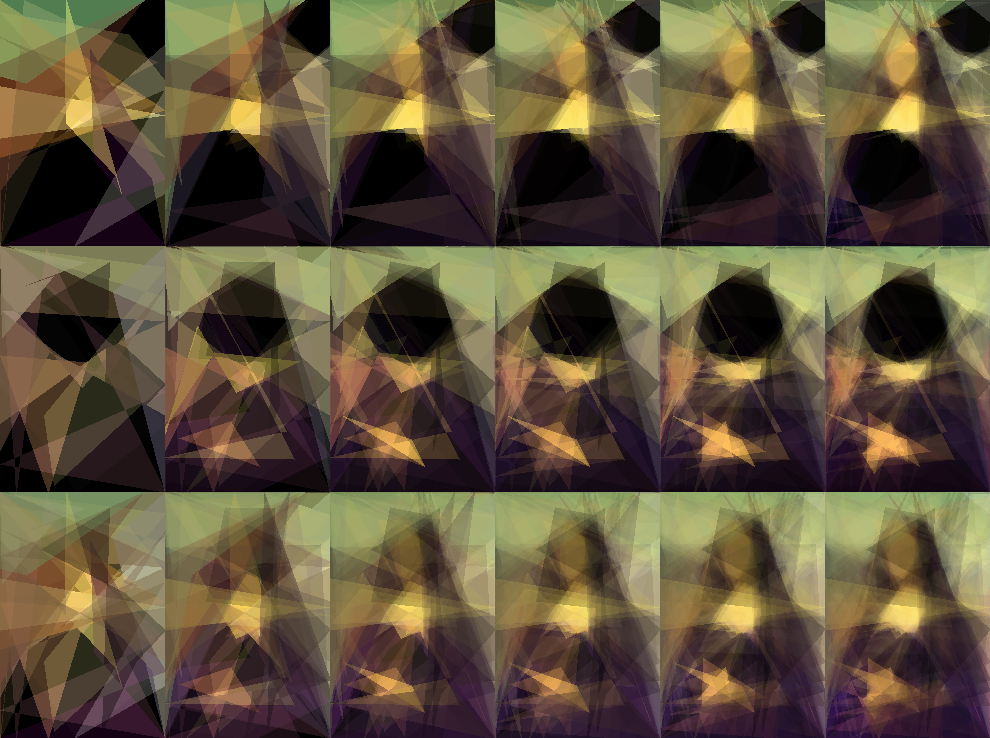

The code for this project is a heavily modified version of https://github.com/itsmux/evolisa.
Added functionalities are round-decreasing offsets when changing polygons, additional mutation possibilities, freezing polygons when improvement are rare coupled with the addition of a new set of polygons (copies of the frozen polygons), andl as improvements to the fitness function and image drawing.

